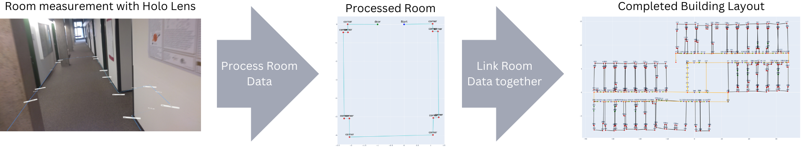

[](https://github.com/NoahMeissner/Indoor-Mapping-with-Holo-Lens-2)


# Indoor-Mapping-with-Holo-Lens-2



Indoor navigation systems for pedestrians require floor plans of
buildings. Acquiring them is costly and time-consuming as the
standard procedure is to digitalize 2D blueprints and augment them
with information required for navigating users. In this demo, as
an alternative, we use the Holo Lens 2 to construct floor plans on
site. We illustrate how to construct plans that are equally accurate
to digitalized plans, but much efficient to acquire and easier to
be augmented with information about the physical environment
impossible to obtain from blueprints

# Citation
```
@misc{meissner2024indoor,
    title={Indoor Mapping with Holo Lens 2}, 
    author={Noah Meißner, Bernd Ludwig, Steffen Decker and Volker Bräutigam},
    year={2024},
}
```


### Demo Video
Link: https://youtu.be/s5LxNkAr_Cg

https://github.com/NoahMeissner/Indoor-Mapping-with-Holo-Lens-2/assets/108337767/6cd49364-c5c2-42d3-b1fe-73cbd05313e0

